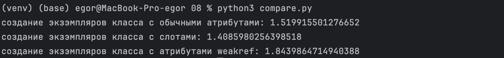
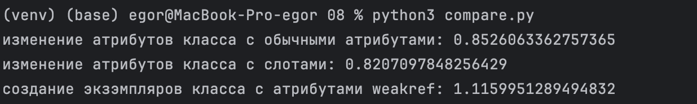
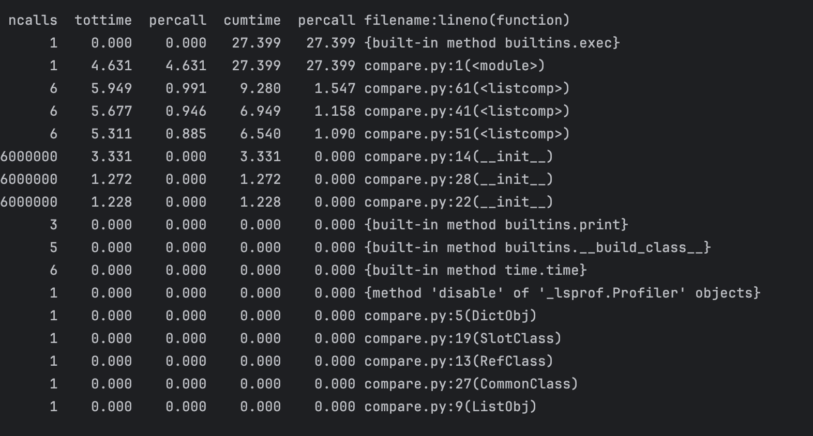

### создания экзэмпляров класса

N = 5.000.000

Эксперимент проводился 6 раз. Выведено среднее время.

Время создания экзэмпляров класса с слабыми ссылками
больше всех. Минимальное время у класса с слотами.

### Изменение атрибутов класса класса

N = 1.000.000

Эксперимент проводился 6 раз. Выведено среднее время.

Время создания экзэмпляров и изменения их атрибутов класса с слабыми ссылками
больше всех. Минимальное время у класса с слотами.

### Профилирование

На создание создание 1.000.000 экзэмпляров класса с обычными атрибутами
тратиться 1.158 секунды, класса со слотами - 1.090 секунды, класса с слабыми ссылками 1.547